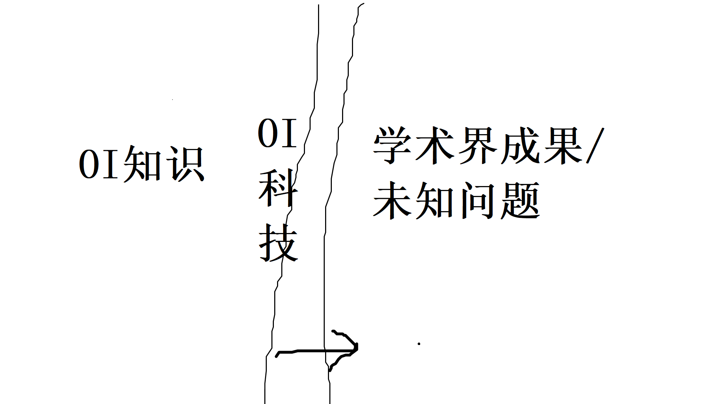

谈一下我关于OI的一些经验与想法吧，会谈的比较零碎

## OI的三种能力

一般认为OI的能力分为三类，知识、码力、思维。大致而言，一般认为知识是指考试开始前就已经掌握的，思维指场上现想的东西，码力指将前两者翻译为代码的能力。

想要真正掌握并灵活运用知识，一定的思维能力是必不可少的。如果发现超出理解能力了，建议不要强行记忆，可以先放弃该知识转而先学习其它东西。虽然我感觉很多”理解不能“的情况是OI发展程度不够，没有好的讲稿或者你没有好的讲稿造成的。

学习知识点最好注意系统性，与其它知识的相关性，搜索资料时优先寻找系统性较强的博客、讲稿、题单的话，因为理论更完备更清晰，与其他领域相关性更强的知识体系，更易于被掌握，被深刻理解。有时候甚至会出现做5道题的学习效率不如做10道题，尽管受OI发展程度所限，我常常遇到后5道题半年后才做到的情况。

思维的话，主要是充分调动运用所学知识的能力。如果是以锻炼思维为目的地做题，可以适当延长思考时间，尽量充分尝试地尝试自己想到的道路并加以完善下去。当然思考时间也不要太长，最好避免没有任何思路的空转，可以适当瞄下题解或std获得提升；以及有时候想不出来并不是单纯的思维能力问题，对于经常出现又难以独立发现的思维中间产物，如果系统性不够被称为知识，我们会称之为技巧、模型，或者”套路“。

严格来说代码能力也算思维能力的一部分，但训练上会有些差异。特别是OI是个写代码的比赛，编写代码的准确度与速度，程序的运行常数这些也是需要注意的。对于一些常见的代码组件或者模板，可以多写几遍形成肌肉记忆提高手速。可以多阅读学习其它人的优秀实现，学习好的代码思路，但是抄代码没什么意义。也可以在不同题目上多尝试不同的实现方式，增加写过的本质不同代码数量。

## 关于科技

经常可以看见OI社群中提到这个词。

严格来说科技属于知识，但是其本身又有特殊性。

左侧是OI已有知识，右边是未引入OI或未被人类得到的知识，中间那条是OI的前线，这些年来一直呈向右扩张的趋势，这里称之为科技，是普及度还不够高下沉度还不够的、新产生的知识。这里提到的科技，更多是关系那些成体系的，并且呈开放态势不断发展的新知识，孤立的小技巧不在考虑范围内。OI里知名的有专门的人在做的科技领域，有数据结构与计数。组合优化其实也引入或发明了相当多足以构成体系的知识，但好像OI界没啥人做。

有的时候也把成体系而不一定新的知识，或者仅仅发言者个人不会的知识称为科技，但我觉得这些含义并不贴切故不在此讨论。

总的来说，我个人是比较喜欢科技的，一方面是更容易进行创造性活动，带来比做题更大的乐趣；另一方面这种探索新知的精神已经事实上成为了OI特别是CNOI不可或缺的一部分。

随着时间推移，中间那条前线上的科技并不仍然被称为科技

* 可能因为普及度足够高而变为一般的知识点，例如2014年还能出现在ZJOI的FFT，现在可能只是noip级别了。这种算是good ending。

* 可能因为普及度太低，没有后人来学习掌握并加以传承，失传了，例如[sone3](https://uoj.ac/problem/281)。这种是bad ending，我觉得被后人遗忘了会削弱当初引入科技的意义。

* 可能被后来的科技完美替代，后人不再记得前人是如何使用该科技解决问题的，从而被逐出OI界了，例如多年以后大家都写 [新的线性递推方法](https://blog.csdn.net/EI_Captain/article/details/109196620?spm=1001.2014.3001.5501) 而忘记了从前写线性递推是要会多项式取模并使用各种奇淫技巧优化常数的。~~这是true ending。~~ 

从上述第三条也可以看到，科技并不总是产生具体的新知识解决了新问题，也可能只是对旧知识的整合，带来了更好更灵活的理解方式，更利于传播，有助于选手更好地理解相关问题，提高学习效率，（甚至可能可以）减少学习时间。~~另外一个例子是我的集训队论文的例题1，以一敌四。~~

一个科技最后能否被成功引入OI，还是要看其难度以及与其它知识的关联程度，即应用场合的广泛程度。难度可以被更好的理解方式压缩，应用场合可以被发现，也可以被人为创造，这增加了预判科技能否成功引入的不确定性。

总的来说，关于科技的学习，既然是处于前线上，学习的是尚未完备封闭的知识，就很容易缺乏好的讲稿好的理解方式好的学习路径好的使用或练习场合，有时学完后甚至需要一些创造性思维来创造使用场合，所以学习科技和学习知识的过程是存在差异的，一般来说单位科技的学习成本会更高，如果考虑到学完后考试不考的机会成本，甚至可能高得离谱。

另外我觉得如果要在正式比赛命题中引入科技题，需要小心谨慎。最好是具备一定普及面，主要参数选手大都有所听闻，并且根据个人能力及其它因素有所取舍地进行学习后，再引入科技。并且引入时要注意试题配置与区分度，分差不宜过大，以降低对因偶然因素没有接触过该科技的选手的影响，包括最后得分差异，包括考察心态；难度最好亲民，以降低掌握科技的选手构思并编写代码的风险，注意科技的不成熟本身就已经制造了一定难度；分差也不宜过小，以对掌握科技的选手提供鼓励。虽然按照现行OI征题模式这段话不太可能有什么硬性效力，只能说希望出题人自觉，起到道德约束的作用。

## 不同学习来源渠道的差异

### CF

比赛多题目多，覆盖的知识面较广，短时间快速思考并准确实现也比较锻炼思维与代码能力。

刷的人也多，意味着里面的技巧/套路如果没有掌握，相对于竞争对手的劣势也会更大。

由于多为2~3h的比赛，意味着训练节奏比5h的OI赛事更快，相应的训练成本（占用时间）也更低，建议基本知识学完后优先把CF rating刷高点，能力提升速度会比较快。

个人感觉现在集训队基本对应2600~2700的cf rating，Ag大概要2300~2400。

当然5h的OI比赛会有更多的深思维长代码的题目，还有(CN)OI专属的知识点，要正确认识这一点，cf rating也只是个OI水平参考指标。

### ATC

ARC的话大致相当于cf div1.5。

AGC的话虽然也是2~3h的比赛，但是平均思维难度比cf高不少，甚至高于很多(CN)OI比赛，不过现在CNOI也有向思维能力倾向的趋势。AGC题目数量比较少，只是单纯做里面的题，不会就看sol的话，很容易出现刷完了39场第40场还是不会的情况。如果做起来吃力，建议可以先弃做AGC，做点ATC上的其它比赛如ARC，或者其它这种日系风格的题目如JOISC。

### 洛谷，loj

量大管饱型的OI题库，有点类似于传统意义上bzoj的地位，可以用来提升OI综合水平，学习套路，锻炼码力。一般认为loj高端点洛谷xxs多点，我觉得影响不大。

两者都有各自的社区风格以及种类繁多的OI题，也都有些高端题。洛谷有托管ynoi，有不定期举办的各种比赛，虽然参差不齐但有些题目质量还是不错的；loj有很多外国题，还有一些国内OIer自行上传的套题或散题可以一看。

### uoj

高端题库，高端社区讨论平台，包括其博客系统与用户群。

如果要刷uoj的话最好有一定基础水平，特别是uoj比赛题，考虑到其题目数量也比较少，其实跟AGC有点像。

### CC

我基本只做过long challenge，感觉类似于印度版的综合型题库，总体上比较偏套路，challenge可以练习乱搞提答能力，最后一题经常偏科技，可以选做一下。

### 集训队作业

好处是有详细的中文题解，坏处是每年画风都不太一样，有的年份可能难度偏高不适合水平不够的选手做，有的年份则题风诡异，几何模拟横行，与(CN)OI相去甚远。

### 模拟赛

质量良莠不齐，一般来说都会有所取舍地做。但建议考试的时候还是努力做以达到模拟效果，因为5h的OI考试经验获得成本很高，你需要抓住机会增进对自己思维敏捷性、代码准确度这些的了解与把握，减少正式比赛中的风险。考后补题尽力而为，我是倾向于认为，即便是不太可能考的知识，对于锻炼思维和码力也是有帮助的。

### VP

一般指CF/CFgym/ATC上虚拟参加在线比赛的功能。

如果不想熬夜又想通过练习真实比赛刷cf rating，VP是很有帮助的。

即便是一直在熬夜打正式比赛的，也可以通过VP以前的场增加训练强度，否则单靠正式cf Round强度其实不一定够。

### 讲课

我个人是不太习惯听课，小课有互动的还好点，大课更不适，感觉看文档更舒服，更容易把握节奏。

### 博客，讲稿，论文

使用前建议多找几个相关题材的对照着看，便于理解。

### 社群

经常有活跃的高水平人士出没，建议善用社群，实际上这是一门学问。我个人其实不太善用社群特别是私聊。

## CNOI试题及其未来走向

先放上OI中古时代的一篇[文章](https://zhuanlan.zhihu.com/p/28551017)。

因为征题制度的原因，CNOI一直以来都和IOI画风迥异，思维考察力度较弱，但各种硬知识技巧考察强度较高。前面那篇文章里提到中古时代之前CNOI经常出现一些根本OI弱相关的内容，用前面关于“科技”一词的分析来说，就是对于尚处在前线以右的知识，不是放到前线上慢慢普及，而是大跃进，直接按照前线以左的知识强行考察。

不过近些年这种行为被慢慢摈弃了，我觉得是与CNOI命题制度的自迭代性有关，尽管CCF方面一直没什么作为，但是上一届的选手会自省会反思他们那届题目的弊端，会有意识地剔除糟粕，引入或创造好的想法，并在下一届的命题中付诸行动，而且这个节奏非常快，一两年内就能完成一个周期。当然由于CNOI命题的松散组织性，现在试题风格仍然和IOI有相当差异，具有自己的特点，诸如CNOI特色数据结构与计数；不过也有向IOI倾斜，向考察思维能力靠拢的趋势，像20年NOI及以下比赛出现的构造题，实际上我认为考察思维能力和CNOI特色并不矛盾。

有说法认为CNOI的选拔赛题的风格和IOI差异较大，需要予以改正。我不赞同，主要是如下几点

* 现在CNOI的征题体制，连征到足够的题都是个麻烦事，更不用提对征到的题加以筛选和精心打磨，尽管具体操作上也有一些涉及到CCF与高校的因素在里面，并不全是OI与硬性规章制度的问题。
* 在上一条的既成事实下，CNOI仍然形成了自己的风格并不断发展，向广大OIer普及了相当多的知识，如果削足适履成IOI的风格，会损失CNOI的已有发展成果，也会削弱知识的普及力度，我觉得这会很可惜。
* 这几年中国队IOI表现卓越，看起来也没什么改进的必要，各方也缺乏改进的动力

构成CNOI现在这个模式的还有一个重要因素是，足够数量的高水平志愿出题人，这会严重影响每一轮迭代速率，但是从WC2020到CTS/WC2021的命题情况来看，感觉高水平志愿出题人一直处于紧缺状态，我觉得这是制约CNOI迭代的隐患。

## HEZ的训练制度

HEZ是我OI生涯进行训练的主要学校。

17-18赛季有相当数量的讲课可以听，17-18和18-19赛季有相当数量的储备模拟赛题可以做，19-20赛季开始就几乎只剩物易物换来的联考题可以做了。

平时训练模式的话，视个人状态而异，除了基本知识点学习外

* （动态题目资源：模拟赛题）模拟赛+补题（时间占用毛估估30%~60%），18-19赛季之后这个算是唯一学校参与组织的训练。19-20赛季以后，每一套模拟赛题都要自己出 $\frac{1}{6}$ 套来交易。
* （动态题目资源：在线OJ）此外习惯上比较喜欢追新鲜的CF/CFgym/ATC/CC比赛题，由于大家都有这个习惯所以追起来会比单挑轻松一些，可以交流讨论，后续补题的人不懂的可以问前面补的人；但这并没有教练参与组织，纯靠学生们自觉。暑假里还会有各种ACM多校可以做。
* （静态题目资源）如果还有空的话会随机做一点uoj/loj/洛谷，第二条的OJ里的古早题目，或者学点博客/讲稿/论文，追下主流OI社群进度啥的。由于19-20赛季开始所有模拟赛题都要自己出题去换，没模拟赛的时候这一比重会加大

实践中一般模拟赛题和OJ比赛题都是补不完的，效果上看大家做题量都比较小，但考试成绩还可以。

虽然也称得上强校，但是仅从训练模式上而言，强在哪里呢？我也不知道，至少看起来训练组织度挺低的，也没什么神秘的静态资源，有的只是需要不断投入精力维护的动态信息渠道。不过另一方面也说明了OI的低垄断与易普及性。

## OI题目的三相性

* 中档题作为一般商品
* 好题作为艺术品，但好像时效性很容易很强，一旦相关科技发生进步就很容易沦为一般商品
* 还可以作为资本用于训练生产下一代题目

